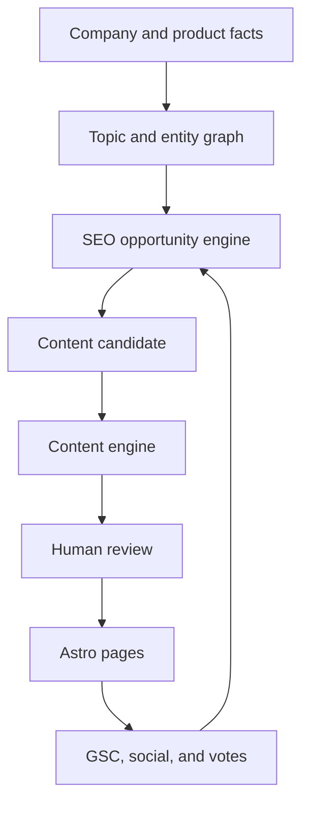

# Architecture

## System shape



## Ownership boundaries

| Layer | Owns | Must not own |
| --- | --- | --- |
| Astro web | rendering, metadata, Schema, UI, thin application calls | scoring policy, database secrets |
| SEO engine | intent, opportunity, cannibalization, quality, linking decisions | page rendering, social UI |
| Content engine | Briefs, prompt assembly, fact injection, draft validation | opportunity prioritization |
| Shared | generic contracts, enums, validation, utilities | industry-specific workflows |
| Supabase | durable state, tenant isolation, relations, metrics | prompt orchestration |
| n8n | schedules and external API orchestration | canonical business rules |

## Data flow rules

1. Source facts carry provenance and remain separate from generated claims.
2. Research creates candidates, not pages.
3. SEO engine produces a decision plus an explainable reason.
4. Only approved candidates enter content creation.
5. Review promotes a draft to a published content record.
6. Astro renders published records or reviewed content collections.
7. Performance data updates decisions; it never silently rewrites content.

## V1 deployment shape

```text
Astro static output -> web hosting/CDN
Supabase            -> Postgres + RLS + later Auth/Realtime
n8n                 -> existing Seoul VPS or another controlled runtime
```

The web app should remain deployable without n8n. A failed workflow must not
break published pages.

## Package dependency direction

```text
apps/web ------------> packages/shared
packages/seo-engine -> packages/shared
packages/content-engine -> packages/shared
```

`seo-engine` and `content-engine` should not depend on each other by default.
An application service composes their results. This keeps “should we create?”
separate from “how should it be created?”.
